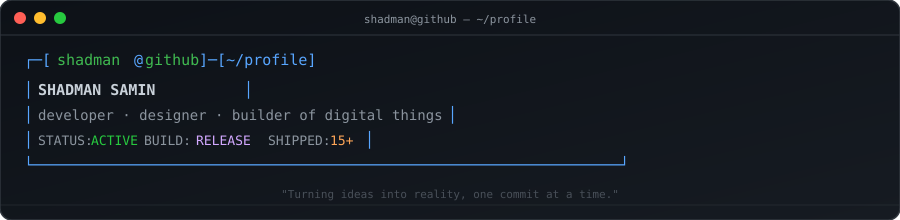

<picture>
  <source media="(prefers-color-scheme: dark)" srcset="assets/banner.svg">
  
</picture>

---

## ./whoami

**Shadman Samin** — SWE Undergrad @ Daffodil International University, Dhaka.
CGPA 3.77/4.00 · Expected '28 · 15+ projects shipped.

Pet Project Enthusiast. Bangla speaker. I thrive at the intersection
of clean code and creative design. If it lives on the internet,
I've probably tried to build it — from CLI tools that tidy your
files to browser extensions that audit your privacy.

---

## ls ~/pet_projects/

| Group | Project | What it does |
|-------|---------|--------------|
| **👁️ Vision & AI** | [DeepXpress](https://github.com/Shadman-Samin/DeepXpress) | Real-time multi-face emotion recognition. 88.27% accuracy. YuNet + MobileFaceNet ONNX. Reads faces better than most people read docs. |
| | [air-draw](https://github.com/Shadman-Samin/air-draw) | Finger painting 2.0 — draw in the air with your webcam. No cleanup required. |
| **🔧 CLI & Systems** | [file-organizer](https://github.com/Shadman-Samin/file-organizer) | CLI utility in pure C that turns messy directories into organized folders. One command, zero bloat. |
| | [project-doctor](https://github.com/Shadman-Samin/project-doctor) | Scans your repos for hygiene issues, scores them, and auto-fixes. Because we all neglect regular checkups. |
| | [Database-Backup-Utility](https://github.com/Shadman-Samin/Database-Backup-Utility) | CLI tool for automated backups with scheduling, compression, and multi-DBMS support. Production-ready paranoia. |
| | [Ghost-Input](https://github.com/Shadman-Samin/Ghost-Input) | Educational keyboard event visualizer. Watches the ghosts in the machine — ethically. |
| | [AutoClickify](https://github.com/Shadman-Samin/AutoClickify) | Cross-platform auto clicker CLI. Hotkey-toggled, thread-safe, GUI-equipped. Click responsibly. |
| **🌐 Web & UX** | [snip](https://github.com/Shadman-Samin/snip) | URL shortener with custom aliases, QR codes, analytics, and a UI that respects both light and dark mode. |
| | [Atmos_weather-app](https://github.com/Shadman-Samin/Atmos_weather-app) | Weather dashboard that actually puts clarity first. Real-time data, city suggestions, interactive maps. |
| | [Periscope](https://github.com/Shadman-Samin/Periscope) | Browser extension that scores every site you visit (0–100) on privacy and security. HTTPS, CSP, cookies, trackers — it sees all. |
| | [MindMirror_MonerAyna](https://github.com/Shadman-Samin/MindMirror_MonerAyna) | মনের আয়না — a Bangla-first personality discovery platform. MBTI-based scenarios, radar charts, shareable insights. Know thyself. |
| **🐱 Just for Fun** | [Cats-Cradle](https://github.com/Shadman-Samin/Cats-Cradle) | Cradle like a cat. It exists. No further explanation needed. |

---

## 📸 In Action

<!-- Drop your screenshots in assets/screenshots/ and they'll show up here -->

<div align="center">

| DeepXpress | air-draw |
|:---:|:---:|
|  |  |
| Real-time emotion recognition | Finger drawing in the air |

| snip | Atmos |
|:---:|:---:|
|  |  |
| URL shortener with QR & analytics | Weather dashboard |

| Periscope | MindMirror |
|:---:|:---:|
|  |  |
| Privacy & security auditor | মনের আয়না — personality discovery |

</div>

---

## ~/.toolbox

```
Languages:    Python · C · HTML · CSS · SQL · Bash
Frameworks:   FastAPI · Flask · OpenCV · MediaPipe · ONNX · NumPy
Tools:        Git · Linux/CLI · REST APIs · UI/UX Design · Databases
```


---

## systemctl status


---

## ~/.bashrc

When I'm not shipping code, you'll find me deep in a book,
tinkering with side projects, or wondering why `Cats-Cradle`
exists. (It just does.)

```bash
# life config
alias read="book"
alias build="side_project"
alias chill="cat_cradle"
```

---

## /connect

```
[LinkedIn]  https://linkedin.com/in/shadman-samin163
[GitHub]    https://github.com/Shadman-Samin
[Instagram] https://instagram.com/shadman_calm
[Facebook]  https://facebook.com/Fake.Samin
[Email]     shadman.samin.163@gmail.com
```

---

```
// built with intention · no templates were harmed
```
